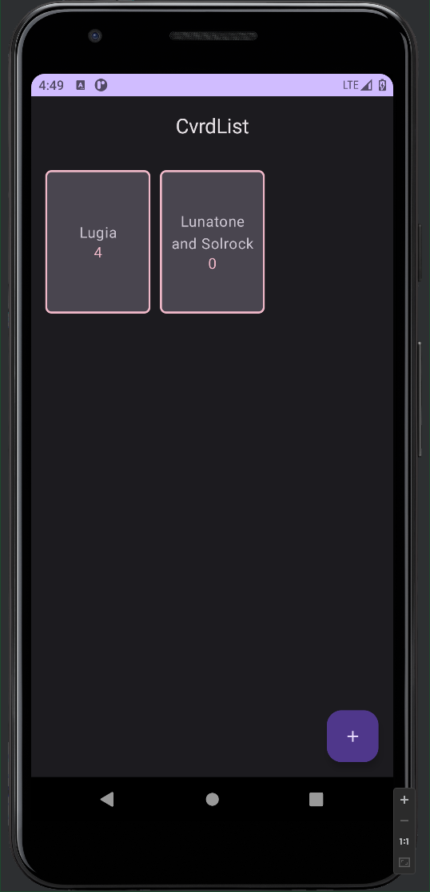
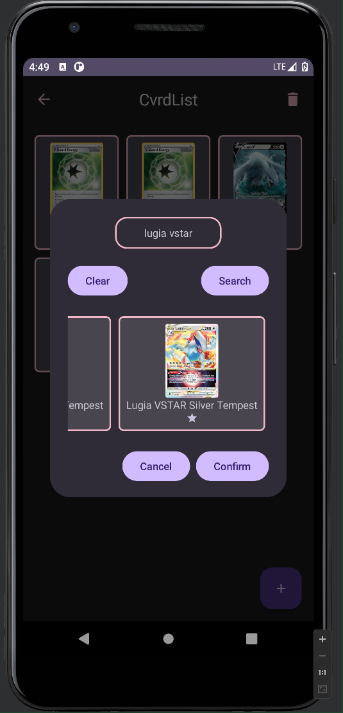

# CvrdList

> This project uses [Pokemon TCG API](https://pokemontcg.io/).

## Preview

---

## Usage

After opening the app for the first time you will not have any cards lists, to create one press the **+** symbol in the bottom right corner, enter your deck name and click **Confirm**.

To enter a deck double click an element (they contain name and current card count), to delete a deck perform a long press on a deck panel and confirm that you indeed want to delete the deck (if not just click away from the confirmation panel).

After entering a deck you will be presented with two new options in the upper menu:

- **Left arrow** - returns to deck view
- **Bin** - removes cards in the current deck annotated with non-default star color (changes on star press)

To add cards to your deck press the **+** symbol to enter card adding menu, enter name of a card and press **Search**. Select cards that you want by clicking the star and making it change color and then click **Confirm**. If you continue to click the search button you will get different pages with other card versions. Press **Clear** to remove all search results. Double click a card (either in adding window or in the list to open card's [Cardmarket](https://www.cardmarket.com/en) page - allows for easy price evaluation). To exit adding menu (without adding cards) click away from the panel or press **Cancel**.
